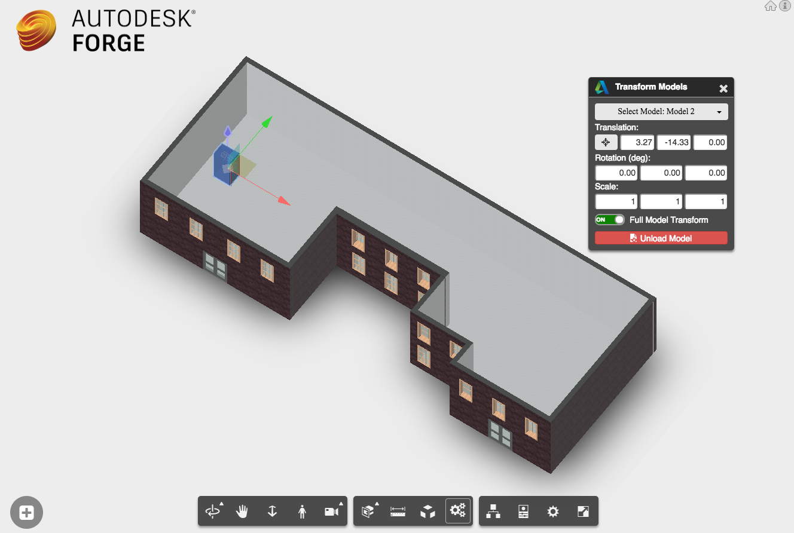

# Viewer XYplane

 

## Description

This Sample demonstrates the use of Transformation access in the Forge Viewer, the chance to add multiple models to the same 3D scene can be achieved. A new extension has been added to the GUI Toolbar of the viewer. Look for the button in the toolbar that has a ‘3 interlocked gear’ icon. Once selected you can select the recently model added and drag it along the XY Axis plane. 

 

### Steps to debug.

The models have been added to the repo, you will need to translate them with your own API keys and host them in your own Bucket. 

I'm using a 2 legged Authentication. 

### Steps to use

- Pick a point in the floor of the model

- Add a rack to the room by clicking the ‘+’ button on the bottom left.

- To move the rack around:

 - Click the button in the toolbar that has a ‘3 interlocked gear’ icon.

 - Select the rack.

 - Use the translation widget that appears to pull the rack around 

 
You can insert additional racks by repeating the above.

### Web Technologies

The sample is using the following Web Technologies.

- Forge Authentication API
- Forge Viewer
- Three.js
- React
- Node.js
- React-scripts

## Setup

### Development mode

Follow these instructions to get the app running locally:

Mac OSX/Linux (Terminal)
	
	> git clone <THIS-REPO>
	> cd TO-REPO-PATH	 
    > npm install
    > export FORGE_CLIENT_ID=<<YOUR CLIENT ID FROM DEVELOPER PORTAL>
    > export FORGE_CLIENT_SECRET=<<YOUR CLIENT SECRET>
    > npm run watch (this runs a dev build with react-scripts which will also create css files in case you are using scss/less/sass files in --watch mode hot-realoading will be available, there is not need to refresh)
   

Windows (use <b>Node.js command line</b> from Start menu)
	
	> git clone <THIS-REPO>
	> cd TO-REPO-PATH	
    > npm install
    > set FORGE_CLIENT_ID=<<YOUR CLIENT ID FROM DEVELOPER PORTAL>
    > set FORGE_CLIENT_SECRET=<<YOUR CLIENT SECRET>
    > npm run watch (this runs a dev build with react-scripts which will also create css files in case you are using scss/less/sass files in --watch mode hot-realoading will be available, there is not need to refresh)

Your browser will Open automatically at:
[http://localhost:3000](http://localhost:3000)

### Production mode

<b>Important:</b> the <b>npm start</b> command, this is intended for <b>PRODUCTION</b> with HTTPS (SSL) secure cookies.

To run a production build you need to run the following commands:

	> npm run build
    > npm start

If you try to deploy this on Heroku, we set a `postinstall` script that will run the `build` script, so there is no need to run it again, simply let Heroku run `npm start` (which it does automatically) and you'll be good to go.

## Heroku Deployment

To deploy this project to Heroku, be sure to set your environment variables in the dashboard:

- `FORGE_CLIENT_ID`
- `FORGE_CLIENT_SECRET`

--------

## License

This sample is licensed under the terms of the [MIT License](http://opensource.org/licenses/MIT).
Please see the [LICENSE](LICENSE) file for full details.

## Written by

Jaime Rosales D.   
  
Forge Partner Development  
<a href="http://developer.autodesk.com/">Forge Developer Portal</a>  

